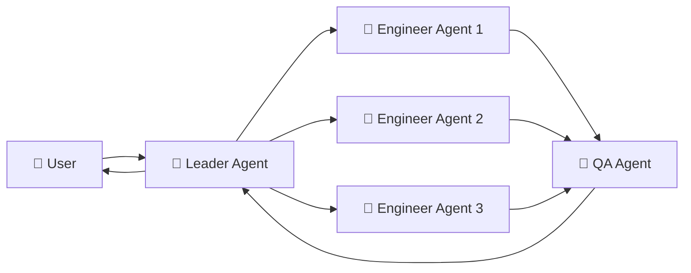

# 🤖 AI駆動マルチエージェント開発フレームワーク

**小規模スタートから段階的にスケールアップ**するマルチエージェント開発システムの設計書・仕様書集

[](https://opensource.org/licenses/MIT)
[]()
[]()

## 🎯 概要

このリポジトリは、**Claude Code**を基盤とした実用的なマルチエージェント開発フレームワークの設計書・仕様書を管理しています。

> **⚠️ 個人用リポジトリ**: このリポジトリは個人的な学習・実験・知識整理を目的としており、他者への提供や汎用的な利用を前提としていません。内容は実践と学習に応じて**適宜更新・改変**されます。

### 🌟 特徴
- **📏 小規模スタート重視**: 3-5エージェントから開始、段階的拡張
- **⚡ 即座に実験開始可能**: 5分で環境構築完了
- **🔄 実用性優先**: オーバーエンジニアリング回避、ROI重視
- **🔧 TDD統合**: テスト駆動開発による品質保証
- **📁 ファイルベース通信**: 簡潔で分かりやすい協調システム
- **🎋 git worktree活用**: 効率的な並列開発環境

---

## 📋 ドキュメント構成

### **📚 コアドキュメント（必読）**

| ドキュメント | 概要 | 対象者 | 優先度 |
|-------------|------|--------|--------|
| **[01_ai_driven_development_requirements.md](./01_ai_driven_development_requirements.md)** | AI駆動開発の要件定義・目的・期待効果 | 全員 | 🔥**最優先** |
| **[02_agent_role_definitions.md](./02_agent_role_definitions.md)** | エージェントの役割・責任・ツール構成 | 実装者 | 🔥**最優先** |
| **[06_multi_agent_operational_workflow.md](./06_multi_agent_operational_workflow.md)** | 運用ワークフロー・実践的実装手順 | 実装者 | 🔥**最優先** |

### **⚙️ 技術仕様書**

| ドキュメント | 概要 | 利用タイミング |
|-------------|------|----------------|
| **[04_tool_integration_specs.md](./04_tool_integration_specs.md)** | MCP統合・ツール連携仕様 | Phase2〜（中規模展開） |
| **[03_knowledge_base_architecture.md](./03_knowledge_base_architecture.md)** | 知識ベース設計・情報管理 | Phase2〜（知識蓄積が必要な時） |

### **🏢 企業レベル参考資料**

| ドキュメント | 概要 | 適用条件 |
|-------------|------|----------|
| **[05_agent_communication_protocol.md](./05_agent_communication_protocol.md)** | 大規模システム向け通信プロトコル | Phase3〜（10+エージェント） |

### **📖 その他**

| ドキュメント | 概要 |
|-------------|------|
| **[research.md](./research.md)** | 調査資料・参考文献・技術的背景 |
| **[logs/](./logs/)** | 開発過程の会話ログ・学習記録 |

---

## 📋 最初に読むべきドキュメント

1. **[01_ai_driven_development_requirements.md](./01_ai_driven_development_requirements.md)** - なぜ・何を・どのようにAIを活用するか
2. **[02_agent_role_definitions.md](./02_agent_role_definitions.md)** - エージェントの役割分担
3. **[06_multi_agent_operational_workflow.md](./06_multi_agent_operational_workflow.md)** - 実際の運用手順

---

## 📈 段階的拡張戦略

### **Phase 1: 小規模スタート（3-5エージェント）**
```yaml
期間: 1-2週間
目標: 基本的なマルチエージェント開発フロー確立・知識ベース活用開始
構成:
  - leader_agent: 1個（Claude Code）
  - engineer_agents: 2-3個（Claude Code）
  - qa_agent: 1個（Claude Code）
通信: ファイルベースYAML
知識ベース活用:
  - AI-First YAML主導アーキテクチャによる要件・設計構造化
  - docs/ai/01_requirements_analysis/ での段階的要件蓄積
  - docs/ai/02_technical_architecture/ での設計知識体系化
  - エージェント間の知識共有による開発効率向上
成功基準:
  - TDD並列実装の成功
  - git worktree環境の効率化確認
  - 開発速度向上の実感
  - 知識ベースに基づく保守性の高いアーキテクチャ構築
```

### **Phase 2: 中規模展開（5-10エージェント）**
```yaml
期間: 2-3週間  
目標: 真の並列開発効率化実現
拡張要素:
  - engineer_agents増加（3-5個）
  - MCP統合（04を参照）
  - 知識ベース高度活用（03を参照）
  - Phase 1で蓄積された知識の活用・発展
成功基準:
  - 複数機能の同時並列開発
  - コンフリクト最小化
  - 開発速度の大幅向上
  - 複雑な業務ロジックの構造化・文書化
```

### **Phase 3: 大規模運用（10+エージェント）**
```yaml
期間: 3-4週間〜
目標: 企業レベルの高度な自動化
検討要素:
  - ACP通信システム（05を参照）
  - Frontend/Backend専門分化
  - 高度な監視・品質保証
成功基準:
  - 人間介入の最小化
  - スケーラブルな体制確立
  - 企業レベル品質確保
```

---

## 👥 エージェント構成

### **Leader Agent（統合リーダー）**
- **ツール**: Claude Code (multiple instances)
- **役割**: 要件整理・基本設計・統合指揮・進捗管理
- **環境**: メインリポジトリ + 統括視点

### **Engineer Agents（TDD並列実装）**
- **ツール**: Claude Code (multiple instances)
- **命名**: `agent-{feature-task-name}`
- **役割**: 詳細設計・TDD実装・単体テスト・PR作成
- **環境**: git worktree個別ディレクトリ

### **QA Agent（品質保証）**
- **ツール**: Claude Code
- **役割**: テスト設計・E2Eテスト・品質保証・統合テスト
- **環境**: テスト専用worktree + 統合環境

---

## 📝 使用方法

### **⚡ 5分クイックスタート**
```bash
# 1. プロダクトリポジトリにsubtree追加
cd your-product
git remote add ai-framework-remote <this-repo-url>
git subtree add --prefix ai-framework ai-framework-remote main --squash

# 2. 最小構成セットアップAdd commentMore actions
mkdir -p .ai/{workflows,contexts,logs}
mkdir -p .ai/agent_communication/{inbox,outbox,processed,templates}
echo ".ai/logs/" >> .gitignore
echo ".ai/agent_communication/processed/" >> .gitignore

# 3. Claude Codeで参照ディレクトリ設定
# ai-framework/project/ と .ai/ を参照対象に追加

# 4. 開発開始
git checkout -b feature/your-feature
git worktree add ../agent-your-feature feature/your-feature
```

### **📖 詳細な使用方法**
**[→ USAGE.md で詳細な導入・開発フロー手順を確認](./USAGE.md)**Add commentMore actions
- 🚀 クイックスタート（ゼロから新規 / 既存プロジェクトに追加）
- ⚙️ Claude Code設定・ディレクトリ構造
- 🤖 リーダーエージェント起動・初期設定
- 📋 基本的な開発フロー（9ステップ詳細ガイド）
- 🔄 更新・メンテナンス・トラブルシューティング

---

## 🎨 プロジェクト固有カスタマイズ

### **📚 知識ベース・ドキュメントのカスタマイズ方法**

共通フレームワーク（`ai-framework/`）をプロジェクトごとにカスタマイズする**オーバーライド方式**：

```bash
# プロダクト固有の知識ベース構築
your-product/
├── ai-framework/                    # 共通フレームワーク（読み取り専用）
└── .ai/
    ├── knowledge_base/              # プロジェクト固有知識ベース
    │   ├── business_domain/         # 業界・ドメイン特化知識
    │   ├── project_architecture/    # プロジェクト固有アーキテクチャ
    │   ├── custom_workflows/        # カスタムワークフロー
    │   └── overrides/              # フレームワーク拡張・上書き
    │       ├── 03_knowledge_base_architecture_custom.md
    │       └── 02_agent_role_definitions_extended.md
    ├── contexts/                    # プロダクト固有コンテキスト
    └── templates/                   # カスタムテンプレート
```

### **🌟 オーバーライド方式の特徴**
- **共通フレームワーク更新の恩恵**を受けながらカスタマイズ可能
- **プロジェクト固有設定**を最優先で適用
- **Claude Codeの優先度設定**でスムーズな参照
- **チーム開発**でも混乱しない明確な構造

### **🔧 Claude Code設定（カスタマイズ対応）**

```json
// .claude/settings.json
{
  "ai.referenceDirectories": [
    "ai-framework/project/",          // 共通フレームワーク
    ".ai/project_docs/",              // プロジェクト特化ドキュメント
    ".ai/knowledge_base/",            // カスタム知識ベース
    ".ai/overrides/",                 // オーバーライド設定
    "src/"                            // プロダクトコード
  ],
  "ai.priority": {
    ".ai/overrides/": "highest",      // カスタマイズが最優先
    ".ai/project_docs/": "high",      // プロジェクト特化が次
    "ai-framework/project/": "medium" // 共通フレームワークは補完
  }
}
```

### **💬 プロンプト指示例（オーバーライド優先）**

#### **Claude Code（Leader Agent）への指示**
```markdown
## 📋 参照優先度（重要）
以下の順序で情報を参照してください：

1. **最優先**: `.ai/overrides/` - プロジェクト特化カスタマイズ
2. **高優先**: `.ai/project_docs/` - プロジェクト固有ドキュメント  
3. **中優先**: `.ai/knowledge_base/` - カスタム知識ベース
4. **補完用**: `ai-framework/project/` - 共通フレームワーク（ベース）

⚠️ **重要**: 同じ内容の情報がある場合、必ず上位の優先度を採用してください。
例：`03_knowledge_base_architecture.md` が複数ある場合 → `.ai/overrides/` 版を使用

## 🎯 このプロジェクトの特徴
- 業界: [ECサイト/SaaS/など]
- 技術スタック: [Next.js, TypeScript, など]
- 特化エージェント: [agent-payment-integration, agent-seo-optimization, など]
```

#### **Claude Code（Engineer Agents）への指示**
```markdown
## 🤖 エージェント作業指示

### 📚 情報参照ルール
**オーバーライド優先**: 以下の順で情報を確認してください
1. `.ai/overrides/XX_custom.md` ← **最優先**
2. `.ai/project_docs/XX.md` 
3. `ai-framework/project/XX.md` ← 補完用

### 🔧 実装ルール  
- **プロジェクト固有設定**（`.ai/`）を基準に実装
- 共通フレームワークは**参考程度**に留める
- カスタムエージェント定義に従って機能実装

### 例：知識ベース参照時
❌ `ai-framework/project/03_knowledge_base_architecture.md`だけ見る
⭕ `.ai/overrides/03_knowledge_base_architecture_custom.md`を**最優先**で参照
```

#### **QA Agent専用指示**
```markdown
## 🧪 テスト・品質保証指示

### 📋 テスト基準の優先度
1. `.ai/overrides/qa_standards_custom.md` ← **プロジェクト特化基準**
2. `.ai/project_docs/testing_requirements.md`
3. `ai-framework/project/06_multi_agent_operational_workflow.md` ← 基本フロー

### 🎯 プロジェクト特化テスト
- **業界固有のテストケース**を重視
- **カスタムエージェントの動作確認**
- **プロジェクト固有の品質基準**を適用

例：ECサイトの場合
- 決済処理の完全性テスト
- 在庫同期の整合性テスト  
- SEO要件の充足確認
```

### **📝 実用的なプロンプトテンプレート**

#### **開発開始時の基本プロンプト**
```markdown
# 🚀 [プロジェクト名] 開発開始

## 📚 参照情報の優先度
`.ai/overrides/` > `.ai/project_docs/` > `ai-framework/project/`

## 🎯 今回のタスク
[具体的なタスク内容]

## ⚠️ 重要な注意事項
- プロジェクト特化設定（`.ai/`配下）を**必ず最優先**で参照
- 共通フレームワークは基本的なフロー理解のみに使用
- カスタムエージェント定義（`.ai/project_docs/domain_specific_agents.md`）に従って実装

## 🔧 参照すべき特化ドキュメント
- [ ] `.ai/overrides/03_knowledge_base_architecture_custom.md`
- [ ] `.ai/project_docs/domain_specific_agents.md`  
- [ ] `.ai/knowledge_base/project_architecture.yaml`
```

#### **機能実装時のプロンプト例**
```markdown
# 🛠️ [機能名] 実装タスク

@.ai/overrides/02_agent_role_definitions_extended.md を参照して、
この機能に最適なエージェント構成で実装してください。

## 📋 実装方針
1. **プロジェクト特化設定を最優先**で適用
2. `.ai/knowledge_base/project_architecture.yaml` の技術スタックに準拠
3. カスタムエージェント（agent-[feature-name]）として実装

## ⚠️ 絶対に確認すること
- [ ] `.ai/overrides/` にカスタマイズ版があるか確認
- [ ] プロジェクト特化の制約・要件を反映
- [ ] 業界固有のベストプラクティスを適用
```

---

## 🔄 ワークフロー例

### **実際の開発フロー（8ステップ）**Add commentMore actions

詳細な手順は **[USAGE.md](./USAGE.md)** を参照してください。

```mermaidAdd commentMore actions
graph TD
    A[Step 1: 要件定義書作成] --> B[Step 2: 基本設計]
    B --> C[Step 3: タスク分割・並列準備]
    C --> D[Step 4: 並列実装開始]
    D --> E[Step 5: PRレビュー]
    E --> F[Step 6: マージ・コンフリクト解消]
    F --> G[Step 7: 統合テスト・E2Eテスト]
    G --> H[Step 8: 最終品質確認・本番準備]
```

### **エージェント協働パターン**



---

## 📄 ライセンス

MIT License - 自由に利用・改変・再配布可能

## 🔗 関連リンク

- **[Claude](https://claude.ai/)**: AIエージェント
- **[git worktree](https://git-scm.com/docs/git-worktree)**: 並列開発環境
- **[MCP Protocol](https://modelcontextprotocol.io/)**: ツール統合プロトコル

**🌟 Star this repo if you find it helpful!** 