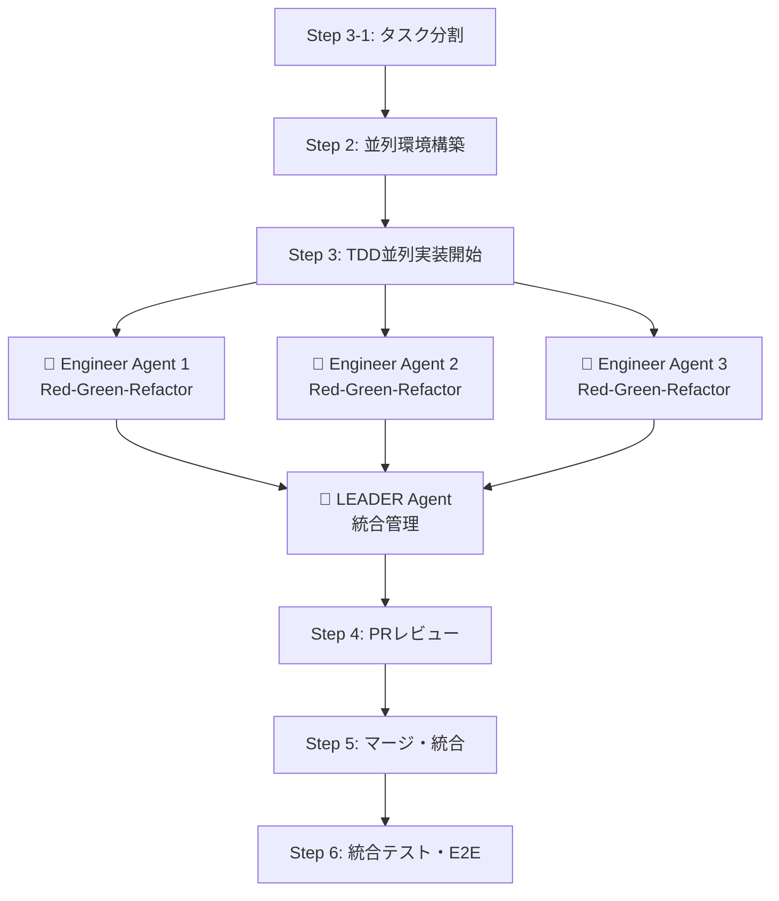

# 📖 AI駆動マルチエージェント開発フレームワーク 使用ガイド

**最小構成でのシンプル導入ガイド**

---

## 🚀 クイックスタート

```bash
# 1. 既存プロジェクトのルートで実行
cd existing-project

# 2. AIフレームワーク追加
git remote add ai-framework-remote <this-repo-url>
git subtree add --prefix ai-framework ai-framework-remote main --squash

# 3. 最小構成セットアップ  
mkdir -p .ai/logs .claude worktrees
cp ai-framework/.claude/settings.json .claude/
echo -e ".ai/logs/\nworktrees/" >> .gitignore

# 4. tmux直接通信システムセットアップ
./ai-framework/scripts/quick-start.sh
```

### 2. エージェント構成
- **LEADER** (pane 0): 統合リーダー・品質管理 (25%)
- **engineer-1** (pane 1): TDD並列実装 (25%)
- **engineer-2** (pane 2): TDD並列実装 (25%)  
- **engineer-3** (pane 3): TDD並列実装 (25%)

## ⚙️ 最小設定

### **Claude Code設定**

**設定ファイル**: [`.claude/settings.json`](.claude/settings.json)

**主な設定内容**:
- ✅ **開発必須コマンド許可**: `git`, `gh`, `npm`, `yarn`, `pnpm`, `pipenv`, `docker`など
- 🛡️ **危険操作禁止**: `git push --force`, `rm /`, `sudo`, システム操作など
- 🔒 **セキュリティ重視**: 最低限の権限で安全な開発環境を提供
- 📝 **ファイル操作許可**: プロジェクト内のファイル読み書き・編集

### **基本ディレクトリ構造**
```
your-project/
├── ai-framework/          # フレームワーク（自動更新）
│   ├── scripts/           # スクリプト集
│   │   ├── setup-agent-communication.sh  # tmux環境構築
│   │   ├── start-agents.sh              # エージェント起動
│   │   ├── agent-send.sh               # 通信テスト
│   │   └── quick-start.sh              # ワンクリック実行
│   └── templates/         # テンプレート集
│       ├── leader_agent_setup_template.md
│       └── engineer_agent_setup_template.md
├── .claude/               # Claude Code設定
│   └── settings.json               # 実際の設定（gitignore推奨）
├── .ai/
│   └── logs/              # 開発記録・通信ログ
│       └── communication.log      # 通信ログ
└── src/                   # プロダクトコード
```

---

## 🤖 リーダーエージェント起動・初期設定

### **システム起動**

#### **簡易実行**
```bash
# 全自動でtmux環境構築＋エージェント起動
./ai-framework/scripts/quick-start.sh
```

#### **手動ステップ実行（カスタマイズ向け）**
```bash
# 1. tmux環境構築 + エージェント起動
./ai-framework/scripts/setup-agent-communication.sh
./ai-framework/scripts/start-agents.sh

# 2. 通信テスト（オプション）
./ai-framework/scripts/agent-send.sh
```

### **エージェント構成**
- **LEADER** (pane 0): 統合リーダー・品質管理 (25%)
- **engineer-1** (pane 1): TDD並列実装 (25%)
- **engineer-2** (pane 2): TDD並列実装 (25%)
- **engineer-3** (pane 3): TDD並列実装 (25%)

**tmuxペイン名**: 各ペインには名前が設定されており、視覚的に識別しやすくなっています。

### **基本操作**
```bash
# tmuxセッション確認
tmux list-sessions

# エージェント環境に接続
tmux attach-session -t agents

# 各ペイン間移動
Ctrl+b → 矢印キー

# セッション終了
tmux kill-session -t agents
```

---

## 📋 基本的な開発フロー

### **🆕 新規プロジェクト開発**
```bash
# 1. tmux直接通信システム起動
./ai-framework/scripts/quick-start.sh

# 2. LEADERペインで開発指示を入力
# agentsセッションのLEADERペイン（左上）をクリックしてアクティブにし、以下を入力：

開発するプロジェクト：
家系図を作成できるWEBアプリケーションを作りたいです。
要件定義から実装まで、エージェント間で協調して進めてください。
```

### **🔧 ai-framework導入済みプロジェクトの機能追加・改修**
```bash
# 1. tmux直接通信システム起動
./ai-framework/scripts/quick-start.sh

# 2. LEADERペインで機能追加指示を入力
# agentsセッションのLEADERペイン（左上）をクリックしてアクティブにし、以下を入力：

既存プロジェクトの機能追加・改修：
既存のECサイトに、商品レビュー機能を追加したいです。
ユーザーが購入した商品にレビューを投稿し、他のユーザーが閲覧できる機能です。

参照すべき既存ドキュメント：
- @README.md（プロジェクト概要・技術スタック）
- @docs/（設計書・API仕様書があれば）
- @.ai/knowledge_base/（知識ベース・あれば）

上記ドキュメントを参照して既存システムを理解し、
エージェント間で協調しながら要件定義から実装まで進めてください。
```

### **📦 ai-framework未導入プロジェクトの移行 + 機能追加**
```bash
# 1. tmux直接通信システム起動
./ai-framework/scripts/quick-start.sh

# 2. LEADERペインでプロジェクト移行＋機能追加指示を入力
# agentsセッションのLEADERペイン（左上）をクリックしてアクティブにし、以下を入力：

ai-framework未導入プロジェクトの移行 + 機能追加：
Next.js + TypeScript + PostgreSQLで構築済みのECサイトに、
商品レビュー機能を追加したいです。

既存プロジェクトのドキュメント：
- @README.md（プロジェクト概要・技術スタック）
- @docs/（設計書・API仕様書があれば）

まず上記を分析して既存プロジェクトの情報を整理・把握してから、
エージェント間で協調して機能追加を進めてください。
```

**これだけで開発開始！** ✨

---

## 🔄 開発の流れ説明

### **🆕 新規プロジェクト開発フロー**

AIエージェントが自動的に以下を実行します：

#### **Phase 1: セットアップ・要件定義**
1. 🤖 リーダーエージェント初期化
2. 🎯 要件定義の対話的ヒアリング
3. 📊 要件定義の構造化・文書化

#### **Phase 2: 設計・準備**
1. 🏗️ 基本設計の提案・調整
2. 📋 タスク分割・並列準備
3. 🧪 テスト計画・設計
4. 🌿 git worktree並列環境構築

#### **Phase 3: 実装**
1. 🤖 複数エンジニアエージェントに直接タスク分配
2. ⚡ TDD並列実装（Red-Green-Refactor）
3. 🔄 リアルタイム直接通信・進捗管理

#### **Phase 4: 統合・完成**
1. ✅ PRレビュー・マージ
2. 🧪 統合テスト・E2Eテスト

### **🔧 ai-framework導入済みプロジェクトの機能追加・改修フロー**

AIエージェントが自動的に以下を実行します：

#### **Phase 1: 既存情報確認・要件定義**
1. 🤖 リーダーエージェント初期化
2. 📊 既存プロジェクト情報の確認・理解
3. 🎯 機能追加・改修要件の対話的ヒアリング
4. 📋 既存機能への影響範囲分析
5. 📊 要件定義の更新・文書化

#### **Phase 2: 統合設計・準備**
1. 🏗️ 既存アーキテクチャに適合した設計提案
2. 📋 既存機能との整合性を考慮したタスク分割
3. 🧪 既存テストとの統合を考慮したテスト計画・設計
4. 🌿 既存ブランチ戦略に適合したgit worktree環境構築

#### **Phase 3: 実装**
1. 🤖 複数エンジニアエージェントに直接タスク分配（既存コード理解済み）
2. ⚡ 既存コードとの整合性を保ったTDD実装
3. 🔄 リアルタイム通信で既存機能への影響を監視しながらの進捗管理

#### **Phase 4: 統合・完成**
1. ✅ 既存機能への影響を考慮したPRレビュー・マージ
2. 🧪 既存機能との統合テスト・回帰テスト・E2Eテスト

---

## 💡 ユーザーの役割

- **初期設定**: プロジェクト概要を伝える
- **要件確認**: AIエージェントの質問に答える
- **設計承認**: 技術選定・アーキテクチャの確認
- **最終確認**: ビジネスロジック・UX/UIの確認

**基本的にはAIエージェントが全て自動実行します！** 🎉

---

## 🔄 TDD並列実装フロー



---

## 🎨 エージェント指示書のカスタマイズ

### **テンプレートファイルの直接編集**

git subtree後、テンプレートファイルは`./ai-framework/templates/`に配置されます。
これらのファイルは直接編集してプロジェクト固有の指示にカスタマイズできます：

```bash
# リーダーエージェントの指示書編集
code ./ai-framework/templates/leader_agent_setup_template.md

# エンジニアエージェントの指示書編集  
code ./ai-framework/templates/engineer_agent_setup_template.md
```

### **カスタマイズ例**

#### **既存開発ガイドライン・ドキュメントの読み込み**Add commentMore actions
```markdown
# テンプレートファイルに追加

## 📚 プロジェクト開発ガイドライン
**作業開始前に以下のドキュメントを必ず読み込んでください：**

### **必須参照ドキュメント**
- **@CONTRIBUTING.md** - 開発者向けコントリビューションガイド
- **@docs/DEVELOPMENT.md** - 開発環境構築・開発フロー
- **@docs/CODING_GUIDELINES.md** - コーディング規約・ベストプラクティス
- **@docs/API_GUIDELINES.md** - API設計・命名規則
- **@docs/TESTING.md** - テスト戦略・テスト実装ガイド

### **プロジェクト固有ドキュメント**
- **@docs/ARCHITECTURE.md** - システム設計・アーキテクチャ概要
- **@docs/DATABASE.md** - データベース設計・マイグレーション
- **@README.md** - プロジェクト概要・セットアップ手順

### **チーム開発ルール**
- **@.github/pull_request_template.md** - PRテンプレート・レビュー基準
- **@.github/ISSUE_TEMPLATE/** - Issue作成ガイドライン
- **@docs/WORKFLOW.md** - ブランチ戦略・デプロイフロー

**⚠️ 重要**: これらのドキュメントの内容に従って作業し、既存のルール・規約を遵守してください。
```

#### **コーディング規約・品質基準の追加**
```markdown
# engineer_agent_setup_template.md に追加

## 📏 コーディング規約
- **ESLint設定**: @typescript-eslint/recommended
- **Prettier設定**: セミコロンあり、シングルクォート
- **命名規則**: camelCase（変数・関数）、PascalCase（コンポーネント）
- **コメント**: JSDoc形式で関数・クラスに必須
```

### **編集後の反映**

テンプレートファイルを編集後、エージェントを再起動して変更を反映：

```bash
# 既存セッション終了
tmux kill-session -t agents 2>/dev/null || true

# エージェント再起動（編集済みテンプレートが読み込まれる）
./ai-framework/scripts/quick-start.sh
```

### **⚠️ 注意事項**

- **subtree更新時の上書き**: フレームワーク更新時にカスタマイズが上書きされる可能性があります
- **バックアップ推奨**: 重要なカスタマイズは別途バックアップを取ることを推奨
- **チーム共有**: カスタマイズした指示書はチーム全体で共有・レビューしてください

---

## 🔄 更新・メンテナンス

```bash
# フレームワーク更新
git subtree pull --prefix ai-framework ai-framework-remote main --squash

# チーム同期
git pull

# tmuxセッションクリーンアップ
tmux kill-session -t agents 2>/dev/null || true
```

---

## 🆘 トラブルシューティング

### **よくある問題**

**Q: エージェントが応答しない**
```bash
# 設定確認
cat .claude/settings.json
```

**Q: tmux通信が機能しない**
```bash
# tmuxセッション確認
tmux list-sessions
# エージェント起動状況確認
tmux list-panes -t agents
# 通信テスト実行
./ai-framework/scripts/agent-send.sh
```

**Q: git worktreeでエラー**
```bash
# クリーンアップ
git worktree prune
```

**Q: subtree更新失敗**
```bash
# 強制更新
git subtree pull --prefix ai-framework ai-framework-remote main --squash --force
```

---

*このガイドで基本的な使用は可能です。詳細が必要な場合は各プロジェクトドキュメント（ai-framework/）を参照してください。*