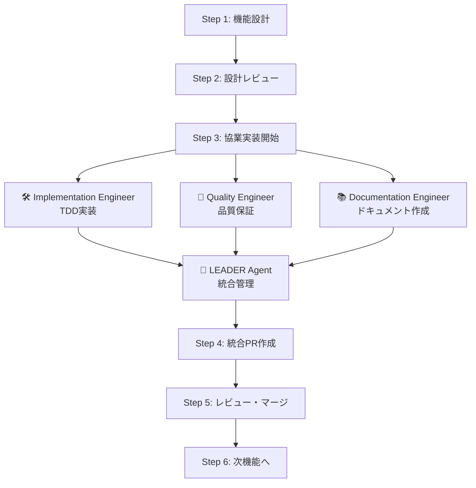

# 📖 AI駆動マルチエージェント開発フレームワーク 使用ガイド

**最小構成でのシンプル導入ガイド**

> **📋 システム概要・エージェント構成・ディレクトリ構造については [README.md](./README.md) を参照してください**

---

## 🚀 クイックスタート

### 📋 事前準備
```bash
# 1. 既存プロジェクトのルートで実行
cd existing-project

# 2. AIフレームワーク準備（プロジェクト外部）
cd ..
git clone <this-repo-url> ai_driven_development

# 3. プロジェクト内にシンボリックリンク作成
cd existing-project
ln -s ../ai_driven_development .ai-framework

# 4. 最小構成セットアップ  
mkdir -p .ai/logs .claude
cp .ai-framework/.claude/settings.json .claude/
echo -e ".ai/logs/\n.ai-framework" >> .gitignore

# 5. クイックスタート
./.ai-framework/scripts/quick-start.sh
```

---

## 📋 基本的な開発フロー

### **🔧 プロジェクトへの機能追加・改修**

#### **Phase 1-2で開始する場合**
```bash
# 1. リーダーエージェントのみで開始（自動的に指示書を読み込み）
./.ai-framework/scripts/phase1-2-start.sh

# 2. 機能追加指示を入力
```

#### **Phase 3から開始する場合**
```bash
# 1. tmux直接通信システム起動
./.ai-framework/scripts/phase3-start.sh

# 2. LEADERペインでタスク分配指示を入力
# agentsセッションのLEADERペイン（左上）をクリックしてアクティブにし、以下を入力：
```

#### **既存プロジェクトの場合（コードベースあり）**
```
機能追加・改修：
ECサイトに商品レビュー機能を追加したいです。
ユーザーが購入した商品にレビューを投稿し、他のユーザーが閲覧できる機能です。

参照すべき既存ドキュメント：
- @README.md（プロジェクト概要・技術スタック）
- @docs/（設計書・API仕様書があれば）
- @.ai/knowledge_base/（知識ベース・あれば）

上記ドキュメントを参照して既存システムを理解し、
エージェント間で協調しながら要件定義から実装まで進めてください。
```

#### **新規プロジェクトの場合（コードベースなし）**
```
機能追加（初期構築）：
ECサイトの基本機能を作成したいです。
- Next.js + TypeScript + PostgreSQLでの環境構築
- 商品一覧・詳細表示機能
- カート機能
- 基本的な決済フロー

技術要件：
- フレームワーク: Next.js 14 (App Router)
- 言語: TypeScript
- DB: PostgreSQL + Prisma
- スタイリング: Tailwind CSS

エージェント間で協調しながら要件定義から実装まで進めてください。
```

**これだけで開発開始！** ✨

---

## 🔄 開発の流れ説明

### **🔧 機能追加・改修フロー（既存・新規共通）**

AIエージェントが自動的に以下を実行します：

#### **Phase 1: プロジェクト理解・要件定義**
1. 🤖 リーダーエージェント初期化
2. 📊 プロジェクト情報の確認（既存コードの有無・技術スタック）
3. 🎯 機能要件の対話的ヒアリング
4. 📋 影響範囲分析（既存プロジェクトの場合）
5. 📊 要件定義の構造化・文書化

#### **Phase 2: 設計・準備**
1. 🏗️ アーキテクチャ設計（既存の場合は適合性確認）
2. 📋 タスク分割・実装計画
3. 🧪 テスト計画・設計
4. 📊 タスクリストファイル作成 (.ai/tasks/)

#### **Phase 3: 実装（tmux使用開始）**
1. 🚀 tmux環境構築・マルチエージェント起動
2. 🤖 エンジニアエージェントに役割分担指示
3. 📋 機能設計ドキュメント作成・レビュー
4. ⚡ 協業実装（TDD・品質保証・ドキュメント作成）
5. 🔄 リアルタイム直接通信・進捗管理

#### **Phase 4: 統合・完成（tmux使用）**
1. ✅ PRレビュー・マージ
2. 🧪 統合テスト・E2Eテスト
3. 📝 ドキュメント更新

---

## 💡 ユーザーの役割

- **初期設定**: プロジェクト概要を伝える
- **要件確認**: AIエージェントの質問に答える
- **設計承認**: 技術選定・アーキテクチャの確認
- **最終確認**: ビジネスロジック・UX/UIの確認

---

## 🔄 協業実装フロー



---

## **Claude Code設定**

**設定ファイル**: [`.claude/settings.json`](.claude/settings.json)

**主な設定内容**:
- ✅ **開発必須コマンド許可**: `git`, `gh`, `npm`, `yarn`, `pnpm`, `pipenv`, `docker`など
- 🛡️ **危険操作禁止**: `git push --force`, `rm /`, `sudo`, システム操作など
- 🔒 **セキュリティ重視**: 最低限の権限で安全な開発環境を提供
- 📝 **ファイル操作許可**: プロジェクト内のファイル読み書き・編集

**プロジェクト構造の詳細はREADME.mdを参照してください**

---

## **tmux基本操作**
```bash
# tmuxセッション確認
tmux list-sessions

# エージェント環境に接続
tmux attach-session -t agents

# 各ペイン間移動
Ctrl+b → 矢印キー

# セッション終了
tmux kill-session -t agents
```


## 🔄 更新・メンテナンス

```bash
# フレームワーク更新
cd ../ai_driven_development
git pull origin main

# プロジェクトに戻る
cd ../your-project

# tmuxセッションクリーンアップ
tmux kill-session -t agents 2>/dev/null || true
```

---

## 🆘 トラブルシューティング

### **よくある問題**

**Q: tmux通信が機能しない**
```bash
# tmuxセッション確認
tmux list-sessions
# エージェント起動状況確認
tmux list-panes -t agents
# 通信テスト実行
./.ai-framework/scripts/agent-send.sh
```

---

*このガイドで基本的な使用は可能です。詳細が必要な場合は各プロジェクトドキュメント（.ai-framework/）を参照してください。*