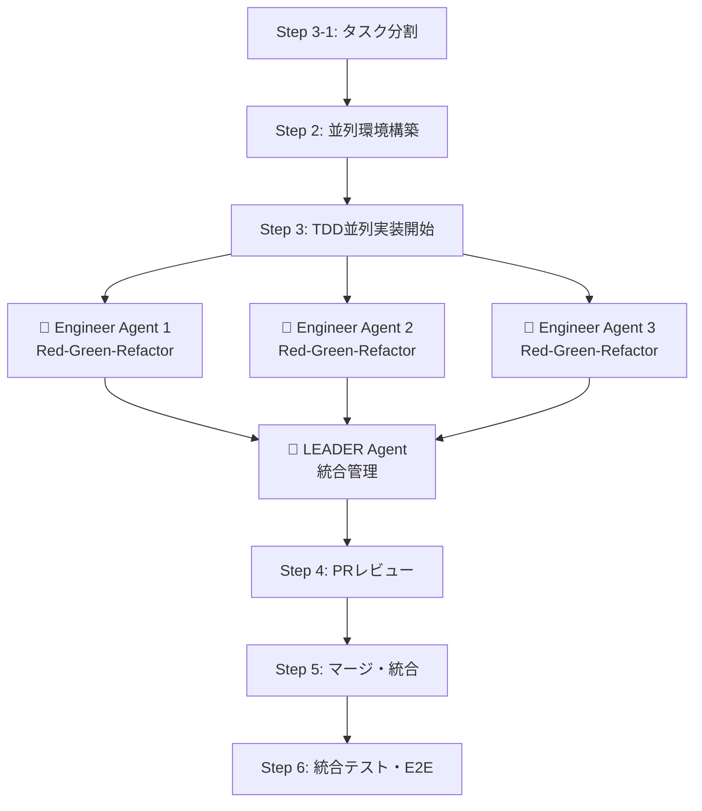

# 📖 AI駆動マルチエージェント開発フレームワーク 使用ガイド

**最小構成でのシンプル導入ガイド**

> **📋 システム概要・エージェント構成・ディレクトリ構造については [README.md](./README.md) を参照してください**

---

## 🚀 クイックスタート

### 📋 事前準備
```bash
# 1. 既存プロジェクトのルートで実行
cd existing-project

# 2. AIフレームワーク準備（プロジェクト外部）
cd ..
git clone <this-repo-url> ai_driven_development

# 3. プロジェクト内にシンボリックリンク作成
cd existing-project
ln -s ../ai_driven_development .ai-framework

# 4. 最小構成セットアップ  
mkdir -p .ai/logs .claude worktrees
cp .ai-framework/.claude/settings.json .claude/
echo -e ".ai/logs/\nworktrees/\n.ai-framework" >> .gitignore
```

### 🚀 実行オプション

#### **オプション1: Phase 1-2のみ実行（tmux不使用）**
```bash
# 要件定義とタスク分割のみ実行
./.ai-framework/scripts/phase1-2-start.sh
```

#### **オプション2: Phase 3から開始（tmux使用）**
```bash
# 並列実装から開始
./.ai-framework/scripts/phase3-start.sh
```

#### **オプション3: クイックスタート（選択式）**
```bash
# 実行オプションを選択
./.ai-framework/scripts/quick-start.sh
```

### 2. エージェント起動完了
4つのエージェントが自動的に起動されます

## ⚙️ 最小設定

### **Claude Code設定**

**設定ファイル**: [`.claude/settings.json`](.claude/settings.json)

**主な設定内容**:
- ✅ **開発必須コマンド許可**: `git`, `gh`, `npm`, `yarn`, `pnpm`, `pipenv`, `docker`など
- 🛡️ **危険操作禁止**: `git push --force`, `rm /`, `sudo`, システム操作など
- 🔒 **セキュリティ重視**: 最低限の権限で安全な開発環境を提供
- 📝 **ファイル操作許可**: プロジェクト内のファイル読み書き・編集

**プロジェクト構造の詳細はREADME.mdを参照してください**

---

## 🤖 リーダーエージェント起動・初期設定

### **システム起動**

#### **Phase 1-2（tmux不使用）**
```bash
# Claude Codeを直接起動
./.ai-framework/scripts/phase1-2-start.sh
```

#### **Phase 3以降（tmux使用）**
```bash
# tmux環境構築 + マルチエージェント起動
./.ai-framework/scripts/phase3-start.sh
```

#### **手動ステップ実行（カスタマイズ向け）**
```bash
# 1. tmux環境構築 + エージェント起動
./.ai-framework/scripts/setup-agent-communication.sh
./.ai-framework/scripts/start-agents.sh

# 2. 通信テスト（オプション）
./.ai-framework/scripts/agent-send.sh
```

**エージェント構成の詳細はREADME.mdを参照してください**

### **基本操作**
```bash
# tmuxセッション確認
tmux list-sessions

# エージェント環境に接続
tmux attach-session -t agents

# 各ペイン間移動
Ctrl+b → 矢印キー

# セッション終了
tmux kill-session -t agents
```

---

## 📋 基本的な開発フロー

### **🔧 プロジェクトへの機能追加・改修**

#### **Phase 1-2で開始する場合**
```bash
# 1. リーダーエージェントのみで開始
./.ai-framework/scripts/phase1-2-start.sh

# 2. Claude Codeが起動したら、以下のコマンドでリーダーエージェントの指示書を読み込み
cat .ai-framework/.claude/agents/leader.md

# 3. 機能追加指示を入力
```

#### **Phase 3から開始する場合**
```bash
# 1. tmux直接通信システム起動
./.ai-framework/scripts/phase3-start.sh

# 2. LEADERペインでタスク分配指示を入力
# agentsセッションのLEADERペイン（左上）をクリックしてアクティブにし、以下を入力：
```

#### **既存プロジェクトの場合（コードベースあり）**
```
機能追加・改修：
ECサイトに商品レビュー機能を追加したいです。
ユーザーが購入した商品にレビューを投稿し、他のユーザーが閲覧できる機能です。

参照すべき既存ドキュメント：
- @README.md（プロジェクト概要・技術スタック）
- @docs/（設計書・API仕様書があれば）
- @.ai/knowledge_base/（知識ベース・あれば）

上記ドキュメントを参照して既存システムを理解し、
エージェント間で協調しながら要件定義から実装まで進めてください。
```

#### **新規プロジェクトの場合（コードベースなし）**
```
機能追加（初期構築）：
ECサイトの基本機能を作成したいです。
- Next.js + TypeScript + PostgreSQLでの環境構築
- 商品一覧・詳細表示機能
- カート機能
- 基本的な決済フロー

技術要件：
- フレームワーク: Next.js 14 (App Router)
- 言語: TypeScript
- DB: PostgreSQL + Prisma
- スタイリング: Tailwind CSS

エージェント間で協調しながら要件定義から実装まで進めてください。
```

**これだけで開発開始！** ✨

---

## 🔄 開発の流れ説明

### **🔧 機能追加・改修フロー（既存・新規共通）**

AIエージェントが自動的に以下を実行します：

#### **Phase 1: プロジェクト理解・要件定義**
1. 🤖 リーダーエージェント初期化
2. 📊 プロジェクト情報の確認（既存コードの有無・技術スタック）
3. 🎯 機能要件の対話的ヒアリング
4. 📋 影響範囲分析（既存プロジェクトの場合）
5. 📊 要件定義の構造化・文書化

#### **Phase 2: 設計・準備**
1. 🏗️ アーキテクチャ設計（既存の場合は適合性確認）
2. 📋 タスク分割・並列実装計画
3. 🧪 テスト計画・設計
4. 📊 タスクリストファイル作成 (.ai/tasks/)

#### **Phase 3: 実装（tmux使用開始）**
1. 🚀 tmux環境構築・マルチエージェント起動
2. 🤖 複数エンジニアエージェントに直接タスク分配
3. 🌿 git worktree並列環境構築
4. ⚡ TDD並列実装（Red-Green-Refactor）
5. 🔄 リアルタイム直接通信・進捗管理

#### **Phase 4: 統合・完成（tmux使用）**
1. ✅ PRレビュー・マージ
2. 🧪 統合テスト・E2Eテスト
3. 📝 ドキュメント更新

---

## 💡 ユーザーの役割

- **初期設定**: プロジェクト概要を伝える
- **要件確認**: AIエージェントの質問に答える
- **設計承認**: 技術選定・アーキテクチャの確認
- **最終確認**: ビジネスロジック・UX/UIの確認

---

## 🔄 TDD並列実装フロー



---

## 🎨 エージェント指示書のカスタマイズ

### **テンプレートファイルの直接編集**

テンプレートファイルは`./.ai-framework/templates/`に配置されます。
これらのファイルは直接編集してプロジェクト固有の指示にカスタマイズできます：

```bash
# リーダーエージェントの指示書編集
code ./.ai-framework/templates/leader_agent_setup_template.md

# エンジニアエージェントの指示書編集  
code ./.ai-framework/templates/engineer_agent_setup_template.md
```

### **カスタマイズ例**

#### **既存開発ガイドライン・ドキュメントの読み込み**Add commentMore actions
```markdown
# テンプレートファイルに追加

## 📚 プロジェクト開発ガイドライン
**作業開始前に以下のドキュメントを必ず読み込んでください：**

### **必須参照ドキュメント**
- **@CONTRIBUTING.md** - 開発者向けコントリビューションガイド
- **@docs/DEVELOPMENT.md** - 開発環境構築・開発フロー
- **@docs/CODING_GUIDELINES.md** - コーディング規約・ベストプラクティス
- **@docs/API_GUIDELINES.md** - API設計・命名規則
- **@docs/TESTING.md** - テスト戦略・テスト実装ガイド

### **プロジェクト固有ドキュメント**
- **@docs/ARCHITECTURE.md** - システム設計・アーキテクチャ概要
- **@docs/DATABASE.md** - データベース設計・マイグレーション
- **@README.md** - プロジェクト概要・セットアップ手順

### **チーム開発ルール**
- **@.github/pull_request_template.md** - PRテンプレート・レビュー基準
- **@.github/ISSUE_TEMPLATE/** - Issue作成ガイドライン
- **@docs/WORKFLOW.md** - ブランチ戦略・デプロイフロー

**⚠️ 重要**: これらのドキュメントの内容に従って作業し、既存のルール・規約を遵守してください。
```

#### **コーディング規約・品質基準の追加**
```markdown
# engineer_agent_setup_template.md に追加

## 📏 コーディング規約
- **ESLint設定**: @typescript-eslint/recommended
- **Prettier設定**: セミコロンあり、シングルクォート
- **命名規則**: camelCase（変数・関数）、PascalCase（コンポーネント）
- **コメント**: JSDoc形式で関数・クラスに必須
```

### **編集後の反映**

テンプレートファイルを編集後、エージェントを再起動して変更を反映：

```bash
# 既存セッション終了
tmux kill-session -t agents 2>/dev/null || true

# エージェント再起動（編集済みテンプレートが読み込まれる）
./.ai-framework/scripts/quick-start.sh
```

### **⚠️ 注意事項**

- **subtree更新時の上書き**: フレームワーク更新時にカスタマイズが上書きされる可能性があります
- **バックアップ推奨**: 重要なカスタマイズは別途バックアップを取ることを推奨
- **チーム共有**: カスタマイズした指示書はチーム全体で共有・レビューしてください

---

## 🔄 更新・メンテナンス

```bash
# フレームワーク更新
cd ../ai_driven_development
git pull origin main

# プロジェクトに戻る
cd ../your-project

# tmuxセッションクリーンアップ
tmux kill-session -t agents 2>/dev/null || true
```

---

## 🆘 トラブルシューティング

### **よくある問題**

**Q: エージェントが応答しない**
```bash
# 設定確認
cat .claude/settings.json
```

**Q: tmux通信が機能しない**
```bash
# tmuxセッション確認
tmux list-sessions
# エージェント起動状況確認
tmux list-panes -t agents
# 通信テスト実行
./.ai-framework/scripts/agent-send.sh
```

**Q: git worktreeでエラー**
```bash
# クリーンアップ
git worktree prune
```

**Q: フレームワーク更新失敗**
```bash
# 強制更新
cd ../ai_driven_development
git reset --hard HEAD
git pull origin main
```

---

*このガイドで基本的な使用は可能です。詳細が必要な場合は各プロジェクトドキュメント（.ai-framework/）を参照してください。*