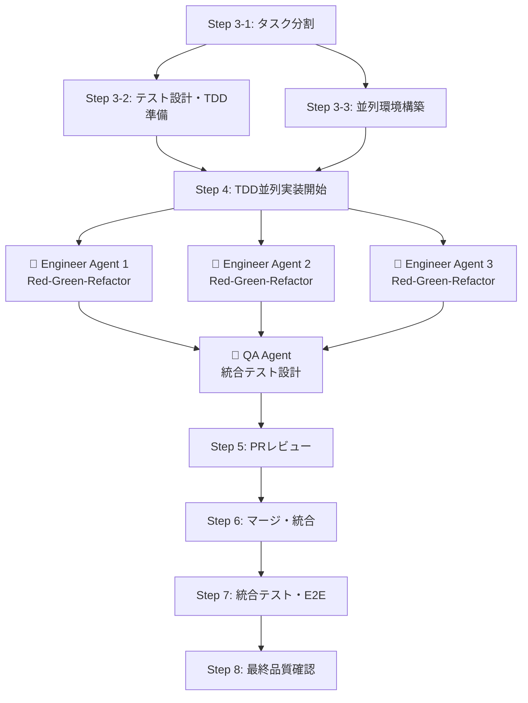
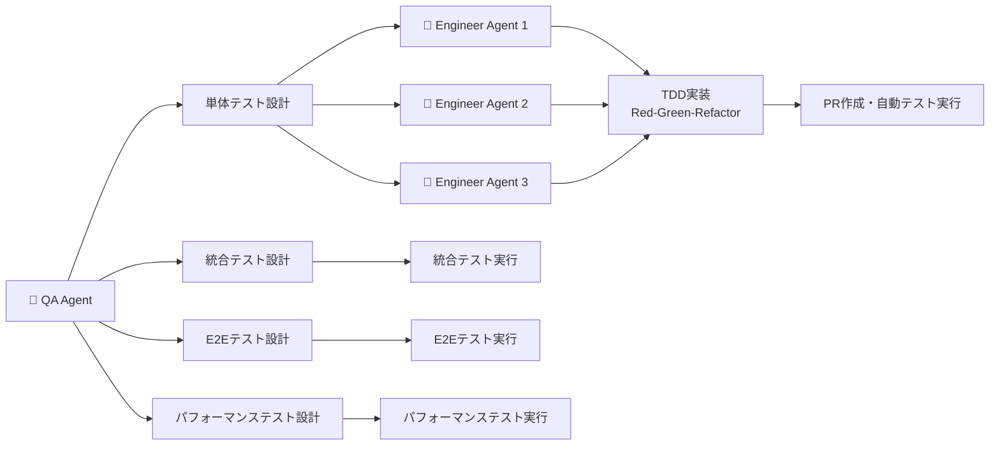

# 📖 AI駆動マルチエージェント開発フレームワーク 使用ガイド

**最小構成でのシンプル導入ガイド**

---

## 🚀 クイックスタート

### **パターン1: ゼロから新規プロジェクト開始**

```bash
# 1. プロジェクト作成
mkdir my-new-project && cd my-new-project

# 2. AIフレームワーク追加
git remote add ai-framework-remote <this-repo-url>
git subtree add --prefix ai-framework ai-framework-remote main --squash

# 3. 最小構成セットアップ
mkdir -p .ai/{workflows,contexts,logs}
mkdir -p .ai/agent_communication/{inbox,outbox,processed,templates}
echo ".ai/logs/" >> .gitignore
echo ".ai/agent_communication/processed/" >> .gitignore

```

### **パターン2: 既存プロジェクトに追加**

```bash
# 1. 既存プロジェクトのルートで実行
cd existing-project

# 2. AIフレームワーク追加
git remote add ai-framework-remote <this-repo-url>
git subtree add --prefix ai-framework ai-framework-remote main --squash

# 3. 最小構成セットアップ  
mkdir -p .ai/{workflows,contexts,logs}
mkdir -p .ai/agent_communication/{inbox,outbox,processed,templates}
echo ".ai/logs/" >> .gitignore
echo ".ai/agent_communication/processed/" >> .gitignore
```

---

## ⚙️ 最小設定

### **Claude Code設定 (.claude/settings.json)**
```json
{
  "ai.referenceDirectories": [
    "ai-framework/project/",
    ".ai/",
    "src/"
  ]
}
```

### **基本ディレクトリ構造**
```
your-project/
├── ai-framework/          # フレームワーク（自動更新）
├── .ai/
│   ├── workflows/         # 作業手順
│   ├── contexts/          # プロジェクト知識
│   ├── logs/              # 開発記録
│   └── agent_communication/  # エージェント間通信
│       ├── inbox/         # 受信メッセージ
│       ├── outbox/        # 送信メッセージ
│       ├── processed/     # 処理済み（gitignore）
│       └── templates/     # テンプレート
└── src/                   # プロダクトコード
```

---

## 🤖 リーダーエージェント起動・初期設定

### **Leader Agent (Claude Code) セットアップ**

**@ai-framework/project/leader_agent_setup_template.md** の基本セットアップ指示を使用してください：

```markdown
1. テンプレートから基本セットアップ指示をコピー
2. プロジェクト固有カスタマイズで該当項目を調整
3. Claude Codeに指示として送信
```

---

## 📋 基本的な開発フロー

### **Step 1: 要件定義**

#### **Step 1-1: 要件定義書の作成**
```markdown
# Claude Codeに指示
"新しいプロジェクトの要件定義を作成します。
@ai-framework/project/03_knowledge_base_architecture.md の
AI-First YAML主導アーキテクチャに従って、
docs/ai/01_requirements_analysis/ 配下に構造化データを作成してください。

ビジネス要求から詳細なユーザーストーリーまで、
段階的にヒアリングして精緻に作成してください。"
```

#### **Step 1-2: 反復的な要件精査**
```markdown
要件定義の対話プロセス：
1. 🎯 ビジネス目標・ステークホルダー確認
2. 👥 ユーザーペルソナ・ストーリー定義
3. 🔧 機能要件・非機能要件詳細化
4. ✅ 受入基準・テスト観点明確化
5. 📊 優先度・工数見積・依存関係整理

※ 各段階で複数回の対話・修正を繰り返し、
  YAML構造化データとして精緻に蓄積してください。
```

### **Step 2: 基本設計**
```markdown
# Claude Codeに指示
"要件定義に基づいて基本設計を行ってください。
@ai-framework/project/06_multi_agent_operational_workflow.md の
Phase 1-2 基本設計・協働準備に従って、
docs/ai/02_technical_architecture/ 配下に構造化データを作成してください。

以下の設計を段階的にヒアリングして精緻に作成してください：
1. 技術スタック選定
2. システムアーキテクチャ設計
3. データベース設計
4. API仕様設計"
```

### **Step 2-2: 基本設計の反復的な精査**
```markdown
基本設計の対話プロセス：
1. 🔧 技術スタック選定・ユーザーレビュー
2. 🏗️ システムアーキテクチャ設計・フィードバック対応
3. 🗄️ データベース設計・スキーマ調整
4. 🔌 API仕様設計・インターフェース確認
5. 📊 非機能要件・制約事項の詳細化

※ 各段階でユーザーレビュー・修正を繰り返し、
  エンジニアエージェント協働に最適化された設計として精緻化してください。
```

### **Step 3: タスク分割・並列準備**

#### **Step 3-1: タスク分割** (リーダーエージェント)
```markdown
# Claude Codeに指示
"基本設計に基づいてタスク分割を行ってください。
@ai-framework/project/06_multi_agent_operational_workflow.md の
Phase 2-1 タスク分割に従って実施してください。

以下を実行してください：
1. 機能要求を並列実行可能なタスクに分割
2. タスク間の依存関係を分析・整理
3. タスク優先度付け
4. 実装スケジュール作成

完了後、テスト設計とのタスク分割結果を共有してください。"
```

#### **Step 3-2: テスト設計・TDD準備** (QAエージェント) ⚡ 3-1と並列実行
```markdown
# QAエージェント（Claude Code）起動・指示
@ai-framework/project/qa_agent_setup_template.md の
基本セットアップ指示を使用してQAエージェントを起動してください。

# QAエージェントに指示
"基本設計に基づいてテスト設計・TDD準備を行ってください。
@ai-framework/project/06_multi_agent_operational_workflow.md の
Phase 2-2 テスト設計・TDD準備に従って実施してください。

以下を実行してください：
1. テスト駆動開発戦略の策定
2. 機能別テストケース設計
3. テストデータ設計・モック・スタブ仕様
4. CI/CDテストパイプライン設計

完了後、TDD実装ガイドライン・テストケース仕様書を配布してください。"
```

#### **Step 3-3: 並列環境構築** (リーダーエージェント)
```markdown
# Claude Codeに指示（タスク分割完了後）
"並列開発環境を構築してください。
@ai-framework/project/06_multi_agent_operational_workflow.md の
Phase 2-3 並列環境構築に従って実施してください。

以下を実行してください：
1. 機能別ブランチの作成
2. git worktree環境の構築
3. 各エージェント専用作業ディレクトリの準備
4. テスト実行環境の分離設定

完了後、環境構築状況を整理して確認をお願いします。"
```

### **Step 4: 並列実装開始**
```markdown
# 並列実装準備の確認項目
1. 📋 タスク分割の妥当性・粒度確認
2. 🔗 依存関係・実行順序の確認
3. 🧪 TDD戦略・テスト設計の確認
4. 🌿 git worktree環境・ブランチ構成の確認
5. 🤖 エージェント配置・役割分担の確認

# ユーザー承認後、リーダーエージェント（Claude Code）への指示
"準備完了を確認しました。並列実装を開始してください。
@ai-framework/project/06_multi_agent_operational_workflow.md の
Phase 3 TDD並列実装に従って、各エンジニアエージェントに開発開始指示を送ってください。

## エンジニアエージェント セットアップ
@ai-framework/project/engineer_agent_setup_template.md の
基本セットアップ指示を使用して、各エンジニアエージェントを起動・設定してください。

## 実施手順
以下の手順で実施してください：
1. 各タスクに対応するClaude Codeエンジニアエージェントの起動・配置
2. セットアップテンプレートを使用したエージェント初期化
3. git worktree環境での作業開始指示
4. TDD（Red-Green-Refactor）サイクルでの実装指示
5. エージェント間通信体制の確立・監視開始

## エージェント間通信の管理
定期的に以下の指示でユーザーにエージェント間の連携を確認・促進してください：
- '各エージェント、受信ファイル（.ai/agent_communication/inbox/）を確認・処理してください'
- '進捗状況・課題を .ai/agent_communication/outbox/ に報告してください'
- '設計変更・依存関係の課題があれば、関連エージェントに通知してください'

各エンジニアエージェントへの開始指示を送信して、
並列TDD実装を開始させてください。"
```

### **Step 5: PRレビュー**
```markdown
# エンジニアエージェントのPR作成完了後、Claude Codeに指示
"PRレビューを実施してください。
@ai-framework/project/06_multi_agent_operational_workflow.md の
Phase 4-1 PRレビューに従って実施してください。

## 自動チェック実行
以下の自動チェックを実行してください：
1. 全テストケース実行・成功確認
2. テストカバレッジ基準達成確認（> 90%）
3. コード品質チェック（ESLint/Prettier）
4. セキュリティスキャン
5. パフォーマンステスト

## リーダーエージェントレビュー
以下の観点でレビューしてください：
1. TDD原則遵守確認
2. テストケース品質評価
3. 実装とテストの整合性確認
4. リファクタリング品質評価

完了後、ユーザーレビューが必要な項目を整理して報告してください。"
```

#### **ユーザーレビュー項目**
```markdown
以下の項目をユーザーが確認：
1. 📋 ビジネスロジックの正確性確認
2. ✅ 受け入れ基準の達成確認
3. 🎨 UX/UI の確認（該当する場合）
4. 🔄 API仕様変更の妥当性（該当する場合）
5. 🗄️ データベーススキーマ変更の妥当性（該当する場合）

# ユーザー確認完了後
"レビュー完了しました。マージを実行してください。"
```

### **Step 6: マージ・コンフリクト解消**
```markdown
# Claude Codeに指示（ユーザーレビュー完了後）
"マージ・コンフリクト解消を実施してください。
@ai-framework/project/06_multi_agent_operational_workflow.md の
Phase 4-2 マージ・コンフリクト解消に従って実施してください。

## マージ前チェック
以下を実行してください：
1. マージ前の統合テスト実行
2. テスト競合の自動解決
3. テストデータ統合・調整

## コンフリクト解消
以下の戦略で解決してください：
1. テストケース競合の優先度判定
2. 実装競合の自動調整
3. 複雑な競合はエージェント間協議で解決

## マージ後アクション
マージ完了後、以下を実行してください：
1. 統合テストスイート実行
2. 回帰テスト実行
3. パフォーマンステスト実行
4. デプロイメント準備

完了後、統合結果を報告してください。"
```

### **Step 7: 統合テスト・E2Eテスト**
```markdown
# QAエージェントに指示
"統合テスト・E2Eテストを実施してください。
@ai-framework/project/06_multi_agent_operational_workflow.md の
Phase 5-1 統合テスト・E2Eテストに従って実施してください。

## システム統合テスト
以下のテストを実行してください：
1. サービス間連携テスト
2. API統合テスト実行
3. データフロー統合テスト
4. セキュリティ統合テスト

## E2Eテスト
以下のテストを実行してください：
1. ユーザーシナリオテスト実行
2. ブラウザ自動化テスト
3. モバイル対応テスト（該当する場合）
4. アクセシビリティテスト

## パフォーマンステスト
以下のテストを実行してください：
1. 負荷テスト実行
2. ストレステスト実行
3. メモリリークテスト
4. レスポンス時間測定

テスト実行戦略：
- 段階的テスト実行
- 失敗時の自動分析・報告
- パフォーマンス基準達成確認

完了後、統合テスト結果を報告してください。"
```

### **Step 8: 最終品質確認・本番準備**
```markdown
# QAエージェント・リーダーエージェントに指示
"最終品質確認・本番準備を実施してください。
@ai-framework/project/06_multi_agent_operational_workflow.md の
Phase 5-2 最終品質確認・本番準備に従って実施してください。

## 包括的品質確認
以下の確認を実行してください：
1. 全機能の統合確認
2. 非機能要件の達成確認
3. セキュリティ要件の達成確認
4. パフォーマンス要件の達成確認

## 本番準備確認
以下の準備を確認してください：
1. 本番環境互換性確認
2. デプロイメント手順検証
3. ロールバック手順確認
4. 監視・アラート設定確認

## 成果物作成
以下の成果物を作成してください：
1. 統合テスト結果レポート
2. パフォーマンステスト結果
3. セキュリティ検査結果
4. 本番リリース準備完了報告

完了後、本番リリース準備完了報告を提出してください。"
```

---

## 🧪 テスト設計・QA戦略Add commentMore actions

### **TDD並列実装フロー**



### **テスト設計の階層構造**



### **品質保証の段階別実行**

| 段階 | テスト種別 | 実行者 | 実行タイミング | 成功基準 |
|------|------------|--------|----------------|----------|
| **Phase 1** | 単体テスト | Engineer Agents | TDD実装中 | カバレッジ > 90% |
| **Phase 2** | 統合テスト | QA Agent | マージ後 | 全API連携成功 |
| **Phase 3** | E2Eテスト | QA Agent | 統合完了後 | 全ユーザーシナリオ成功 |
| **Phase 4** | パフォーマンステスト | QA Agent | 最終確認時 | 要件基準達成 |

---

## 🔄 更新・メンテナンス

```bash
# フレームワーク更新
git subtree pull --prefix ai-framework ai-framework-remote main --squash

# チーム同期
git pull

# 通信ファイルクリーンアップ
rm -f .ai/agent_communication/processed/*
```

---

## 🆘 トラブルシューティング

### **よくある問題**

**Q: エージェントが応答しない**
```bash
# 設定確認
cat .claude/settings.json
```

**Q: エージェント間通信が機能しない**
```bash
# 通信ディレクトリ確認
ls -la .ai/agent_communication/
# 権限確認
chmod 755 .ai/agent_communication/inbox/
chmod 755 .ai/agent_communication/outbox/
```

**Q: git worktreeでエラー**
```bash
# クリーンアップ
git worktree prune
```

**Q: subtree更新失敗**
```bash
# 強制更新
git subtree pull --prefix ai-framework ai-framework-remote main --squash --force
```

---

*このガイドで基本的な使用は可能です。詳細が必要な場合は各プロジェクトドキュメント（ai-framework/project/）を参照してください。*